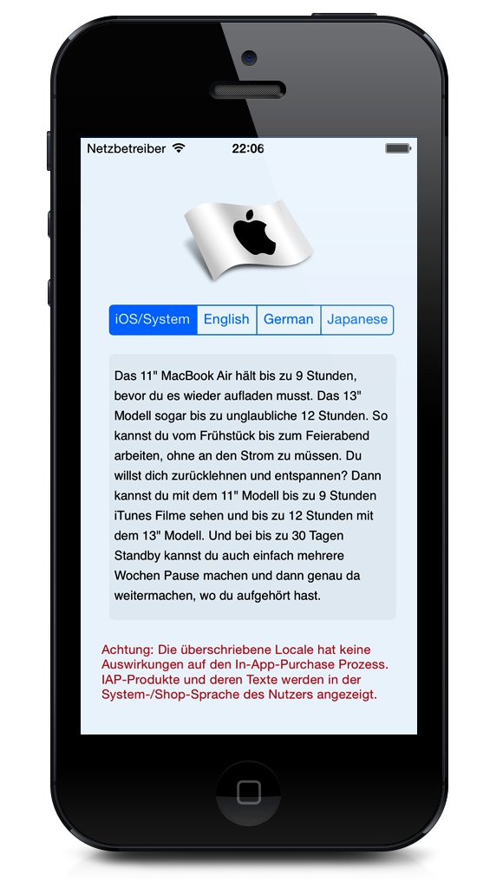

LocaleOverrider
===============

iOS Demonstrator how to override the apps locale in case you need to provide fast Locale switching.

Screenshot
------------

Code
-------------------------
### Locale switching

The code allows to switch to a **Locale** not matter what the system locale might be. This allows for a custom language per App. This is especially useful in Europe, where citizens have a preferred language besides their mother tongue that often is NOT English.

### Integration in your app

Have a look at the `LanguageViewController.m` which shows what you need to do. Basically you drive the `NSUserDefaults` with specific **undocumented** values.

Have fun!
----------------------------
If you like the app you may find a visit to my blog worthwhile over there at [Thetawelle](http://www.thetawelle.de "Thetawelle das Blog"). It has a lot of links to iOS Development related stuff.